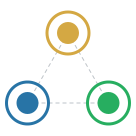

<p align="center">
  
</p>

<h1 align="center">naveenriaz.com</h1>

<p align="center">
  <strong>Where ancient patterns collide with emergent intelligence.</strong>
</p>

<p align="center">
  <a href="https://naveenriaz.com">Live Site</a> · 
  <a href="#architecture">Architecture</a> · 
  <a href="#content-architecture-primitives">Primitives</a> · 
  <a href="#license">License</a>
</p>

---

## The Idea

Most personal sites organise by format: blog, portfolio, about.

This one organises by **dimension of thought**:

```
         Play
        ╱    ╲         ← Why I Live (Soul)
       ╱  ஃ   ╲
      ╱________╲
   Think      Work     ← How I Think (Mind) · What I Build (Body)
```

**Think** is where frameworks live: [SPAR](https://naveenriaz.com/think/spar/) (structured multi-persona deliberation), [STEAL](https://naveenriaz.com/think/steal/) (intelligence capture), [CODEX](https://naveenriaz.com/think/codex/) (cognitive architecture).

**Work** is proof: books, papers, tools, shipped things. Three layers: what I aspire to build (Soul), what my mind is cooking (Mind), what has shipped (Body).

**Play** is the fire underneath: Tamil roots, philosophical detours, origin stories, [CORE identity](https://naveenriaz.com/play/core/) (Calling, Origin, Reason, Endurance).

**Vibe** is the invitation: speaking, consulting, coaching. "Every engagement starts the same way: a conversation."

The ஃ (Ayudha Ezhuthu) at the centre is the Tamil vowel that connects all three dots.

## Content Architecture (Primitives)

Think of a **Primitive** as a specialized container for an idea. Instead of dumping every thought into a generic "blog post", intelligence goes into specialized atomic shapes based on depth (Short/Long) and dimension (Think, Work, Play, Vibe).

| Primitive | Dimension | Length | Layman Definition |
| :--- | :--- | :--- | :--- |
| **Spark** | Think (Mind) | Short | A quick, 108-word observation or raw idea you picked up from the world. |
| **Fusion** | Think (Mind) | Long | A deep essay that combines multiple Sparks into a big-picture theory linking philosophy to execution. |
| **Knot** | Work (Body) | Short | A specific, sticky problem or friction point you noticed in a system. |
| **Claw** | Work (Body) | Long | A bad habit or legacy rule ("Law") that drags an organization down over time. |
| **Dig** | Work (Body) | Long | Deep research into history or literature to extract useful frameworks. |
| **Wow** | Play (Soul) | Short | A quick "aha!" moment where your perspective suddenly shifts. |
| **Awe** | Play (Soul) | Long | A deep emotional story about witnessing something beautiful or profoundly well-designed. |
| **Bead** | Play (Soul) | Long | A piece of hard-earned tactical wisdom or a practical solution built from actual execution. |
| **Sync** | Vibe (Resonance) | Short | A quick connection with a person or idea that perfectly matches your frequency. |
| **SPAR** | Vibe (Resonance) | Long | A structured, multi-player debate (often with AI) used to stress-test your reasoning. |

### Cognitive Routing

The primitives form a dynamic neural network mapping how intelligence flows across four canonical pathways:

1. **The Crucible (Friction-First):** `Knot → Claw → Bead` (Extracting values from systemic constraints)
2. **The Scholar (Research-First):** `Spark → Dig → Fusion` (Tracking external signals to historical roots)
3. **The Collision (Resonance-First):** `Sync → SPAR → Wow → Fusion` (Mindset shifts via high-friction interactions)
4. **The Transmuter (Value-First):** `Bead → SPAR → Knot` (Applying established value to unravel specific tangles)

**The Master Resonance Loop (Ouroboros):** traverses every node to form a biological lifecycle — `Knot → Dig → Claw → Wow → Awe → Bead → Spark → Fusion → Sync → SPAR → [Back to Knot...]`.

## Architecture

```text
src/
├── components/         Astro components (Header, Footer, layour specific chunks)
├── content/            The 10 Primitive collections
│   ├── awes/
│   ├── beads/
│   ├── claws/
│   ├── digs/
│   ├── fusions/
│   ├── knots/
│   ├── sparks/
│   ├── spars/
│   ├── syncs/
│   └── wows/
├── data/               JSON data (pulse, concepts, arena SPARs)
├── layouts/            Base + Page layouts
├── pages/              Pages across Think / Work / Play / Vibe and individual primitives
└── styles/
    ├── brand-tokens.css  Design system tokens (MBS color palette)
    └── global.css        Global styles
```

**Stack**: [Astro](https://astro.build) (static-first, zero JS by default) · Custom CSS (no Tailwind) · TypeScript content schemas

**Design**: SYNTHAI Parchment (dark-mode-first, ancient warmth meets digital precision)

**Data**: Live ecosystem pulse generated from 24 repos, 1000+ commits, 19 knowledge items

## Tamil Roots

Every dimension has a Tamil root word, a Thirukkural verse, and a transliteration. This is not decoration. The Tamil language has 2000+ years of philosophical vocabulary that modern English lacks.

| Dimension | Tamil | Meaning |
|-----------|-------|---------|
| Think | சிந்தனை (Sinthanai) | Disciplined examination through friction |
| Work | செயல் (Seyal) | Action: the bridge between insight and impact |
| Play | ஆன்மா (Aanma) | Soul: the uncodifiable remainder |
| Vibe | ஒலுக்கம் (Olukkam) | Resonance: when two systems vibrate at the same frequency |

## Development

```bash
npm install
npm run dev      # Dev server at localhost:4321
npm run build    # Static build to dist/
```

## Not Accepting Contributions

This is a personal knowledge platform. You're welcome to clone, fork, learn from the code, and be inspired by the architecture. Pull requests are not accepted. If you spot a bug, open an issue.

## License

[MIT](LICENSE)

---

<p align="center">
  <em>Every organisation is alive. Nurture its Mind, Body & Soul. Watch it thrive.</em>
</p>
